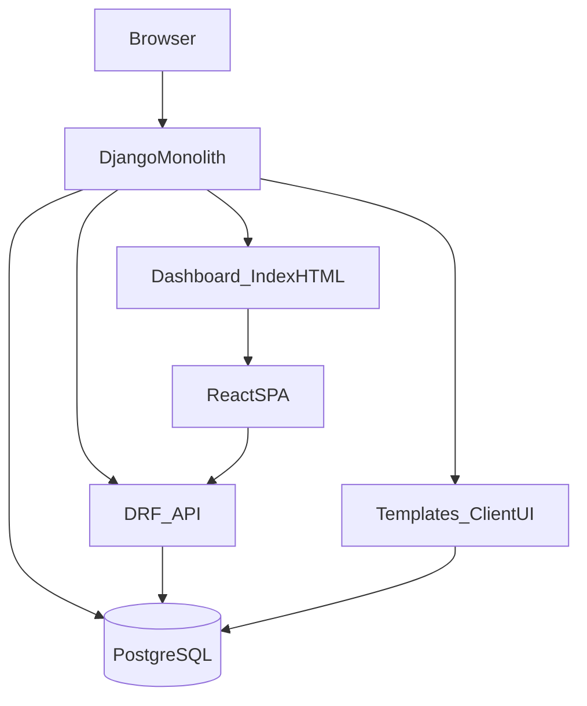

# Спецификация проекта автозапчастей

## Цель

Сделать интернет‑магазин автозапчастей с **современным, но максимально простым** стеком и архитектурой: один Django‑монолит, PostgreSQL, DRF API и один React/Vite SPA для backoffice внутри монолита.

## Технологии (что используем)

- **Backend**: Django (монолит)
- **БД**: PostgreSQL
- **API**: Django REST Framework
- **Авторизация**: Django Sessions (cookie), **без JWT**
- **Клиентская часть**: Django Templates (server‑rendered)
- **Backoffice**: React + Vite, **один SPA** внутри монолита

## Не используем (принципиально)

- WebSocket / realtime
- JWT
- микросервисы
- отдельный фронтенд‑сервер, CORS‑схемы
- отдельный фронтенд‑репозиторий
- webpack
- React через CDN

## Архитектура (как устроено)

- **Один Django‑монолит** обслуживает:
  - server‑rendered страницы клиента (Templates)
  - DRF API (`/api/*`)
  - backoffice SPA (`/dashboard/*`)
- React проект хранится в отдельной папке `frontend/` и собирается через `npm run build`.
- После сборки Vite артефакты подключаются как **static** в Django (никакого отдельного dev/prod фронтенд‑сервера).

### Backoffice маршрутизация

- **Один React SPA** обслуживает все экраны backoffice.
- SPA монтируется на `/dashboard/*`.
- Django:
  - проверяет роль пользователя через middleware
  - отдаёт **один** `index.html` для всех `/dashboard/*`
  - вся дальнейшая навигация — внутри React Router

### Потоки запросов (логический обзор)

## Роли и доступы

- **CLIENT**
  - видит **только свои** заказы и сообщения (и в templates, и через API)
  - не имеет доступа к `/dashboard/*`
- **MANAGER**
  - управляет заказами (назначенными или всеми — определяется правилом проекта)
  - имеет доступ к `/dashboard/*` и соответствующим API
- **ADMIN**
  - полный доступ

### После логина (redirect)

- **CLIENT** остаётся в клиентской части
- **MANAGER/ADMIN** перенаправляются на `/dashboard/`
- `next` учитывать **только если** целевой URL разрешён текущей роли (role‑based redirect)

## Доменные модели (бизнес‑логика)

### User

- Пользователь с ролью (`CLIENT`/`MANAGER`/`ADMIN`).

### Catalog

- **Category**
- **Product**
  - `name`
  - `sku` (unique)
  - `price` (CheckConstraint: > 0)
  - `stock` (CheckConstraint: >= 0)
  - `category` (FK, `PROTECT`)

### Orders

- **Order**
  - `user`
  - `status` (enum)
  - `created_at`, `updated_at`
- **OrderItem**
  - `order`
  - `product`
  - `quantity` (CheckConstraint: > 0)
  - `unit_price` (снимок цены на момент заказа)
- **OrderStatusHistory**
  - `order`
  - `from_status`, `to_status`
  - `changed_by`
  - `changed_at`
- **VinCheckRequest**
  - `order`
  - `vin`
  - `status`
  - `manager`
  - `comment`
  - timestamps

### Chat (без realtime)

- **Message**
  - `order`
  - `author`
  - `text`
  - `created_at`
- **OrderParticipant** (для непрочитанных)
  - `user`
  - `order`
  - `last_read_message_id`

## Ограничения целостности

- `Product.sku` — уникальный
- CheckConstraint:
  - `price > 0`
  - `stock >= 0`
  - `quantity > 0`
- `ForeignKey(PROTECT)` там, где удаление недопустимо для сохранения истории/целостности
- Целостность при удалении: данные истории/заказов не должны «ломаться»

## DRF API (контракт)

Базовый префикс: `/api/`.

### Products

- `GET /api/products/`
- `POST /api/products/`
- `PUT/PATCH /api/products/{id}/`
- `DELETE /api/products/{id}/`

### Categories

- Аналогично products.

### Orders

- `GET /api/orders/`
- `PATCH /api/orders/{id}/status/`

### Messages

- `GET /api/messages/?order_id=&after_id=`
- `POST /api/messages/`

### Permissions (обязательная политика)

- **CLIENT**: только свои объекты (заказы/сообщения)
- **MANAGER**: доступ к назначенным или всем (как задано правилами проекта)
- **ADMIN**: полный доступ
- В DRF должны быть отдельные permission‑классы под эту логику

## Клиентская часть (Django Templates)

- Каталог с фильтрами:
  - категория
  - min/max цена
  - наличие
- Пагинация
- Корзина хранится в `request.session`
- При оформлении создаются `Order` + `OrderItem` (unit_price фиксируется)

## Backoffice (React SPA)

- Один SPA, роутинг внутри React
- Функциональность:
  - CRUD товаров
  - управление заказами (включая смену статуса)
  - чат внутри карточки заказа
- Взаимодействие только через DRF API
- Авторизация через session cookie

## Качество и сопровождение

- Логирование смены статусов
- Django admin как fallback интерфейс
- Тесты (минимум 3–5):
  - constraints
  - permissions
  - login redirect
- DRF OpenAPI schema
- README с описанием архитектуры и сценария демо

## Дизайн‑ассеты и референсы (`static/img`)

Папка `static/img/` хранит референсы макетов/брендинга и логотипы, которые используются при верстке и проверке соответствия дизайну.

### `static/img/pages/` (как должны выглядеть страницы)

- `main.png` — референс/макет главной страницы.

В верстке главной страницы ориентируемся на этот файл. В `static/css/main.css` есть пометка `/* Home page (design/main.png) */` — трактуем её как ссылку на `static/img/pages/main.png`.

#### Актуальный макет и ассеты главной (фактические пути)

Сейчас референсы главной страницы и изображения для блоков лежат в подпапке `static/img/pages/main page/`:

- `static/img/pages/main page/main.png` — актуальный макет главной страницы (источник правды для верстки).
- `static/img/pages/main page/garage.jpg` — изображение для блока «Гараж RideX» (должно быть вставлено в соответствующий блок вместо плейсхолдера).

##### Изображения категорий для блока «Популярные категории»

Картинки для карточек категорий лежат в `static/img/pages/main page/category/` и используются на главной странице в блоке «Популярные категории»:

- **Бамперы** → `bamper.jpg`
- **Капот** → `kapot.jpg`
- **Крылья** → `krylo.jpg`
- **Двери** → `dver.jpg`
- **Крышка багажника / Пятая дверь** → `kryska bagaznika.jpg`
- **Крыша** → `kryisha.jpg`
- **Пороги** → `porogi.jpg`
- **Решетки и облицовка** → `reshetka.png`
- **Зеркала** → `zerkalo.png`

Примечание: в путях есть пробелы (`main page`, `kryska bagaznika.jpg`) — при подключении через Django `` это допустимо, но важно использовать точный путь.

### `static/img/colors/` (палитра)

Референсы свотчей палитры:

- `Rectangle 1.png`
- `Rectangle 2.png`
- `Rectangle 3.png`
- `Rectangle 4.png`
- `Rectangle 5.png`

Технически в коде цвета задаются через CSS‑переменные в `:root` файла `static/css/main.css` (они и являются источником правды для UI).

### `static/img/logo/` (логотипы и надпись)

Логотипы RideX в разных размерах/вариантах:

- `logo biggest.png`
- `logo big.png`
- `logo small.png`
- `logo smallest.png`
- `logo different view.png` — **сводный макет/превью**, где показан логотип во всех вариациях (в т. ч. со шрифтом и цветами).
- `black and white logo.png`

Дополнительно:

- `RideX name.svg` — **эталон того, как должен выглядеть текст/надпись** «RideX» (не “иконка” логотипа).
- `font.png` — референс типографики/шрифта (как выглядит).

Фактическое подключение шрифта в проекте сейчас сделано через Google Fonts (Inter) в `templates/base.html`.

