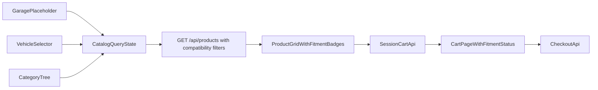

# План реализации гибридного каталога и корзины (React SPA)

## Цель

Сделать клиентскую часть магазина как React storefront с единым состоянием каталога (`vehicle + category + filters + sort + page`), двумя рабочими входами (`Выбрать авто`, `Категории`) и заглушкой `Гараж`, а также с удобной сессионной корзиной.

## Архитектурные решения

- **Storefront на React SPA**: отдельные публичные роуты и layout, не смешивая с backoffice.
- **Корзина v1**: сессионная (guest/user одинаково, без merge между устройствами).
- **Гибридный каталог**: один экран каталога, 3 точки входа (гараж-заглушка, авто-селектор, категории).
- **Совместимость**: серверный фильтр каталога по выбранному авто + клиентский бейдж статуса в карточке/корзине.

## Что переиспользуем

- API-клиент: [c:/Users/avtom/Desktop/diplom/frontend/src/api/client.js](c:/Users/avtom/Desktop/diplom/frontend/src/api/client.js)
- Общие UI-компоненты (селекты/поиск): [c:/Users/avtom/Desktop/diplom/frontend/src/components/common/SearchSelect.jsx](c:/Users/avtom/Desktop/diplom/frontend/src/components/common/SearchSelect.jsx)
- Справочники авто/категорий с API: [c:/Users/avtom/Desktop/diplom/api/views.py](c:/Users/avtom/Desktop/diplom/api/views.py), [c:/Users/avtom/Desktop/diplom/api/urls.py](c:/Users/avtom/Desktop/diplom/api/urls.py)
- Текущая логика корзины (адаптировать под JSON API): [c:/Users/avtom/Desktop/diplom/orders/cart.py](c:/Users/avtom/Desktop/diplom/orders/cart.py), [c:/Users/avtom/Desktop/diplom/orders/views.py](c:/Users/avtom/Desktop/diplom/orders/views.py)

## Этапы реализации

1. **Публичный роутинг storefront**
  - Добавить в React публичные маршруты: `/shop`, `/shop/catalog`, `/shop/cart`, `/shop/checkout`.
  - Вынести отдельный `StorefrontLayout` с верхней панелью: `Ваше авто`, `Категория`, `Гараж (заглушка)`.
2. **Единое состояние каталога и URL-синхронизация**
  - Ввести store/query-state для: `vehicleContext`, `categoryId`, `filters`, `sort`, `page`.
  - Синхронизировать с query params, чтобы deep-link работал из любых входов.
3. **API для гибридной фильтрации товаров**
  - Расширить `GET /api/products/` в [c:/Users/avtom/Desktop/diplom/api/views.py](c:/Users/avtom/Desktop/diplom/api/views.py) параметрами совместимости (минимум: `body_type_id`, `tech_variant_id`, опционально `brand_id/model_id/generation_id`).
  - В ответ списка добавить легкий флаг совместимости для выбранного контекста (или возвращать достаточно данных для расчета на фронте).
  - Не трогать backoffice-сценарии, сохранить обратную совместимость текущих параметров.
4. **UI каталога (гибрид)**
  - Экран каталога: левая колонка категорий + фильтры, сверху sticky `Выбор авто` + кнопка `Гараж` (disabled/coming soon), справа список карточек.
  - Реализовать состояния карточки: `Подходит`, `Не проверено`, `Не подходит`.
  - Добавить быстрые действия: `Сбросить авто`, `Сбросить фильтры`, `Показать все/только подходящие`.
5. **Сессионная корзина через API**
  - Добавить JSON-endpoints для корзины (list/add/update/remove/clear) поверх текущей session-логики в [c:/Users/avtom/Desktop/diplom/orders/cart.py](c:/Users/avtom/Desktop/diplom/orders/cart.py).
  - На фронте сделать `CartPage` с пересчетом total, qty-контролами и отображением fitment-статуса у позиций.
  - При смене авто в каталоге/шапке выполнять перепроверку статуса товаров в корзине.
6. **Checkout и валидации**
  - Подключить checkout из SPA к существующему серверному созданию заказа (через API endpoint под storefront).
  - Валидировать `stock` и целостность позиции на сервере перед созданием заказа.
  - Если позиция `Не подходит` — предупреждение и подтверждение (или блокировка по бизнес-правилу).
7. **Тестирование и приемка**
  - Backend: тесты на фильтры каталога по авто, API корзины, создание заказа из корзины.
  - Frontend: e2e happy-path (категория -> авто -> в корзину -> checkout), сценарий смены авто, пустые состояния.

## Поток данных (гибрид)

## Риски и контроль

- **Риск:** дублирование логики совместимости между template-каталогом и API.
  - **Контроль:** централизовать фильтрацию в `ProductViewSet` и использовать ее же для storefront.
- **Риск:** тяжелый payload списка товаров.
  - **Контроль:** разделить list/detail сериализацию, минимизировать поля в list.
- **Риск:** расхождение поведения backoffice/storefront.
  - **Контроль:** отдельные публичные страницы и API-контракты без влияния на `/admin` и `/manager`.

