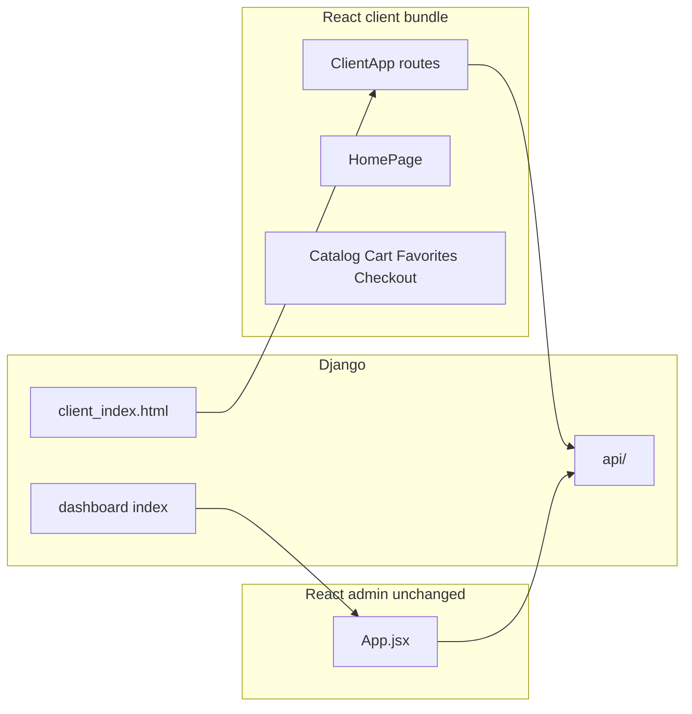

# План: единое клиентское React-приложение + отдельная админка

## Целевая архитектура

- **Клиент:** один entry (новое имя файла на усмотрение, например `[frontend/src/clientMain.jsx](frontend/src/clientMain.jsx)`), один `BrowserRouter` с `**basename=""**` (корень сайта).
- **Админка:** без изменений — `[frontend/src/main.jsx](frontend/src/main.jsx)` → `dashboard-main.js`, `[templates/dashboard/index.html](templates/dashboard/index.html)`, префикс `/dashboard/`.

## URL-стратегия (рекомендация)

Перейти на **плоские публичные пути** без префикса `/shop`:

| Было                | Станет                               |
| ------------------- | ------------------------------------ |
| `/shop/catalog`     | `/catalog`                           |
| `/shop/cart`        | `/cart`                              |
| `/shop/checkout`    | `/checkout`                          |
| `/shop/favorites`   | `/favorites`                         |
| `/` (Django `home`) | `/` (тот же SPA, маршрут `HomePage`) |

В Django добавить **301/302 редиректы** со старых `/shop/...` на новые, чтобы не ломать закладки и внешние ссылки.

Legacy `[catalog/views.product_list](catalog/views.py)` (`/catalog/`): либо редирект на SPA `/catalog` с сохранением query string, либо полное отключение шаблонного каталога после проверки.

## Frontend: шаги

1. **Новый корневой роутер**
  - Вынести текущее содержимое `[StorefrontApp.jsx](frontend/src/storefront/StorefrontApp.jsx)` в общий блок маршрутов (можно переименовать в `ClientApp.jsx` или оставить модуль `storefront/` как поддерево компонентов).  
  - Добавить маршрут `**/` → HomePage`** (новый компонент).
2. **Главная страница**
  - Перенести разметку и логику из `[templates/catalog/home.html](templates/catalog/home.html)` + контекст из `[catalog/views.home](catalog/views.py)` в React: данные категорий через существующий `**GET /api/categories/**`; маппинг картинок категорий (сейчас в `views.home`) — в константу/хелпер на фронте или отдельный статический JSON.  
  - Ссылки «в каталог» вести на `**/catalog?category=...**` как сейчас делает сайт для витрины.
3. **Общая оболочка сайта**
  - Чтобы не дублировать `[base.html](templates/base.html)`, сверстать **единый `ClientLayout**`: шапка/футер как у публичного сайта (логотип, ссылки Каталог/Поиск/Корзина/Вход), внутри `<Outlet />` для страниц. Сейчас часть этого уже в `[StorefrontLayout.jsx](frontend/src/storefront/StorefrontLayout.jsx)` — расширить под главную и выровнять с `base.html` (те же URL имен Django можно заменить на обычные `href="/cart"` там, где маршруты в SPA).
4. **Ссылки и basename**
  - Убрать `basename="/shop"` из текущего `[storefrontMain.jsx](frontend/src/storefrontMain.jsx)`; заменить entry на новый `clientMain.jsx`, монтирование в `**#client-root**` (или переименовать id в шаблоне).  
  - Пройтись по `Link to="..."` и navigate: заменить `/catalog` относительно корня (уже без `/shop`).
5. **Vite**
  - В `[frontend/vite.config.mts](frontend/vite.config.mts)`: переименовать input `storefront` → `client` (или оставить ключ, но выходной файл согласовать с шаблоном), выход `**assets/client-main.js**` (или сохранить `storefront-main.js`, чтобы меньше править шаблон — на усмотрение при реализации).
6. **Заказы (опционально, фаза 2)**
  - Страницы `[orders/](templates/orders/)` (`order_list`, `order_detail`) пока могут оставаться Django-шаблонами с `base.html`, если не хотите раздувать первый этап. Для полного объединения клиента — добавить маршруты `/orders`, `/orders/:id` и вызовы `[OrderViewSet](api/views.py)` / существующих API. Это отдельный подэтап после стабилизации главной и каталога.

## Django: шаги

1. **Шаблон SPA**
  - Новый минимальный шаблон, например `[templates/catalog/client_index.html](templates/catalog/client_index.html)`: ``, контейнер `#client-root`, подключение собранного JS/CSS (как в `[storefront_index.html](templates/catalog/storefront_index.html)`), при необходимости `csrf_token` в meta для POST из SPA.
2. **View**
  - Функция `client_app` / `client_index`: `render(request, 'catalog/client_index.html')` с `@ensure_csrf_cookie` при необходимости (как для витрины).
3. **Маршруты `[catalog/urls.py](catalog/urls.py)**`
  - `**path('', client_index)**` — отдаёт SPA для `/` (вместо текущего `views.home` **или** `home` временно редиректит на `/` если оставить совместимость — лучше сразу один шаблон).  
  - Явные пути `**/catalog/`, `/cart/`, `/checkout/`, `/favorites/**` → тот же view (одна и та же HTML-оболочка).  
  - `**re_path` catch-all** для вложенных client-маршрутов при необходимости (например глубокие ссылки).  
  - Старые `**/shop/...**`: `RedirectView` / view с редиректом на новые пути.  
  - Удалить или превратить в редирект `**product_list**` при `/catalog/` если он конфликтует с SPA (важно: порядок urlpatterns — SPA vs старый каталог).
4. **Статика**
  - После `npm run build` скопировать/обновить выходной бандл в `static/` (как уже принято в проекте для `dashboard-main.js` / `storefront-main.js`).
5. **Не трогать**
  - `[config/dashboard/urls](dashboard/urls.py)`, админка Django, `/api/`, `[templates/dashboard/index.html](templates/dashboard/index.html)`.

## Риски и проверки

- **Конфликт путей:** Django `orders/`, `accounts/`, `admin/`, `dashboard/`, `api/` не должны перехватываться catch-all SPA — в `urlpatterns` проекта порядок уже с приоритетом префиксов; клиентский catch-all держать **только** внутри `catalog.urls` на явном наборе префиксов, а не на `.*` всего сайта.
- **SEO/главная:** при полном CSR для `/` учитывать необходимость мета-тегов (позже: SSR/prerender при необходимости).
- **Авторизация:** вход/регистрация могут оставаться полноэкранными Django-страницами (`/accounts/login/`) с переходом назад на SPA — без обязательного переноса в React в первом этапе.

## Критерий готовности этапа 1

- Одна сборка клиента, одна точка монтирования, маршруты `/`, `/catalog`, `/cart`, `/checkout`, `/favorites` работают без `/shop`.
- Редиректы с `/shop/*` работают.
- Админка собирается и открывается как сейчас.
- `python manage.py check`, ручной smoke: главная → каталог → корзина → (по возможности) checkout.

